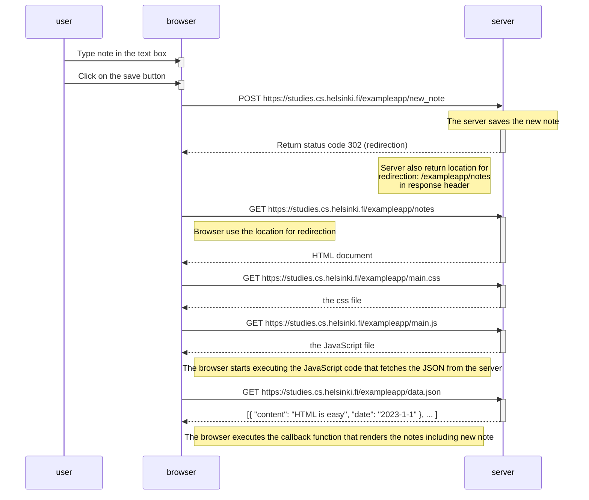

# Sequence Diagram: User creates a new note on the page

```mermaid
sequenceDiagram
    participant user
    participant browser
    participant server

    user->>browser: Type note in the text box
    activate browser
    deactivate browser
    
    user->>browser: Click on the save button
    activate browser
    deactivate browser

    browser->>server: POST https://studies.cs.helsinki.fi/exampleapp/new_note
    Note over server: The server saves the new note
    activate server
    server-->>browser: Return status code 302 (redirection)
    deactivate server

    Note left of server:  Server also return location for <br> redirection: /exampleapp/notes <br> in response header

    browser->>server: GET https://studies.cs.helsinki.fi/exampleapp/notes
    activate server
    Note right of browser:  Browser use the location for redirection 
    server-->>browser: HTML document
    deactivate server

    browser->>server: GET https://studies.cs.helsinki.fi/exampleapp/main.css
    activate server
    server-->>browser: the css file
    deactivate server

    browser->>server: GET https://studies.cs.helsinki.fi/exampleapp/main.js
    activate server
    server-->>browser: the JavaScript file
    deactivate server

    Note right of browser: The browser starts executing the JavaScript code that fetches the JSON from the server

    browser->>server: GET https://studies.cs.helsinki.fi/exampleapp/data.json
    activate server
    server-->>browser: [{ "content": "HTML is easy", "date": "2023-1-1" }, ... ]
    deactivate server

    Note right of browser: The browser executes the callback function that renders the notes including new note
    

    
```    