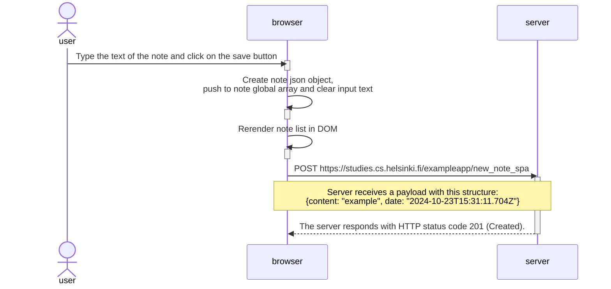

```mermaid
sequenceDiagram
    actor user
    participant browser
    participant server

    user->>browser: Type the text of the note and click on the save button
    activate browser
    deactivate browser

    browser->>browser: Create note json object, <br> push to note global array and clear input text
    activate browser
    deactivate browser

    browser->>browser: Rerender note list in DOM
    activate browser
    deactivate browser

    browser->>server: POST https://studies.cs.helsinki.fi/exampleapp/new_note_spa
    activate server
    Note over browser,server: Server receives a payload with this structure: <br> {content: "example", date: "2024-10-23T15:31:11.704Z"}
    server-->>browser: The server responds with HTTP status code 201 (Created).
    deactivate server
    
```    